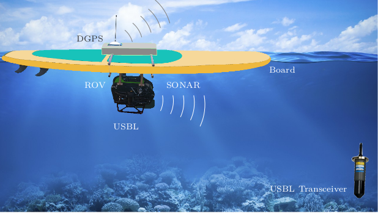

# The B-PR-F Neural Network

The research on autonomous robotics has focused on the aspect of information fusion from redundant estimates. Choosing a convenient fusion policy, that reduces the impact of unmodeled noise, and is computationally efficient, is an open research issue. The objective of this work is to study the problem of underwater localization which is a challenging field of research, given the dynamic aspect of the environment. For this, we explore navigation task scenarios based on inertial and geophysical sensory. We propose a neural network framework named B-PR-F which heuristically performs adaptable fusion of information, based on the principle of contextual anticipation of the localization signal within an ordered processing neighborhood. In the framework black-box unimodal estimations are related to the task context, and the confidence on individual estimates is evaluated before fusing information. A study conducted in a virtual environment illustrates the relevance of the model in fusing information under multiple task scenarios. A real experiment shows that our model outperforms the Kalman Filter and the Augmented Monte Carlo Localization algorithms in the task. We believe that the principle proposed can be relevant to related application fields, involving the problem of state estimation from the fusion of redundant information.

## Project content

In this repository you will find the GNU Octave implementation of the framework proposed for the simulation and the experimental studies. Watch the project video by clicking on the image bellow

## Instructions

All that is required to do is to run the main scripts within the folders. Some auxilliary scripts are provided to generate additional plots for comparisson. In the experimental study, the implementation of the algorithms under comparison are provided in the folder "Experimental/filters".

The algorithms were developed and tested in GNU Octave 4.0.0, running in the operative system Ubuntu 16.04. 

## Work reference

For more details about the model, please consult the original reference:

H. F. Chame, M. M. dos Santos, S. S. C. Botelho (2018) **Neural network for black-box fusion of underwater robot localization under unmodeled noise** *Robotics and Autonomous Systems*, Elsevier. doi: 10.1016/j.robot.2018.08.013

Consult [online](https://www.sciencedirect.com/science/article/pii/S0921889018302926).

